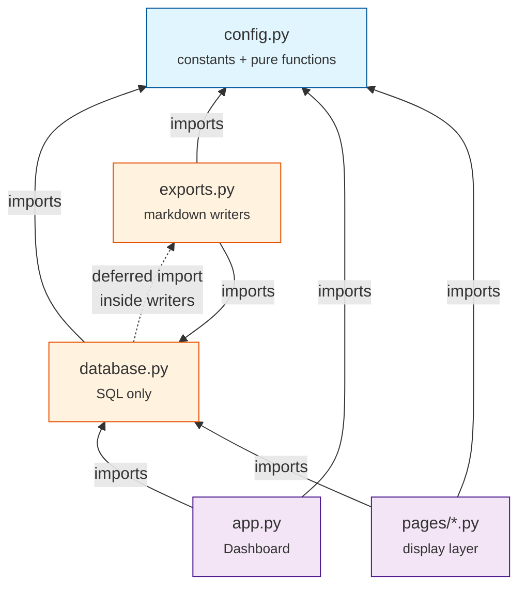

# System Design: Academic Application Tracker
**Version:** 1.5 | **Last updated:** 2026-05-06 | **Status:** authoritative

---

## Table of Contents

1. [Purpose & Scope](#1-purpose--scope)
2. [Architecture Overview](#2-architecture-overview)
3. [Technology Stack](#3-technology-stack)
4. [File Structure](#4-file-structure)
5. [config.py — Specification](#5-configpy--specification)
6. [Database Schema](#6-database-schema)
7. [Module Contracts](#7-module-contracts)
8. [UI Design — Page by Page](#8-ui-design--page-by-page)
9. [Cross-page Data Flows](#9-cross-page-data-flows)
10. [Key Architectural Decisions](#10-key-architectural-decisions)
11. [Extension Guide](#11-extension-guide)
12. [Future Directions](#12-future-directions)

---

## 1. Purpose & Scope

### Problem
An academic job search means tracking dozens of positions in parallel across different institutions, each with unique deadlines, document requirements, recommendation letter logistics, and outcome timelines. A spreadsheet or markdown file cannot answer the daily question: **"What do I do today?"**

### Solution
A local, single-user web app that:
- Captures new positions in under 30 seconds
- Auto-computes and surfaces urgent actions
- Tracks recommendation letter status per recommender, per position
- Maintains human-readable markdown exports as a portable backup
- Extends to a general job tracker via a single config file edit

### Explicit Non-Goals (v1)
- No auth
- No cloud deploy
- No mobile-first layout
- No email/calendar integration
- No multi-user

---

## 2. Architecture Overview



The dotted edge from `database` to `exports` is the deferred-import escape hatch that breaks the otherwise-circular dependency. Solid edges represent module-top imports.

### Layer rules (enforced)

| Layer | May import | May NOT import |
|-------|-----------|----------------|
| Page files | `database`, `config` | `exports` (directly), each other |
| `database.py` | `config`, `sqlite3`, `pandas` | `streamlit`, `exports` (top-level — deferred import only) |
| `exports.py` | `database`, `config` | `streamlit` |
| `config.py` | stdlib only | anything from this project |

---

## 3. Technology Stack

| Component | Choice | Required ≥ | Rationale |
|-----------|--------|-----------|-----------|
| Language | Python | 3.11 | Declared floor in `pyproject.toml`; familiar to stats/data users |
| Environment | venv (`.venv/`) | stdlib | Zero extra tools; isolates pkgs; gitignored |
| UI framework | Streamlit | 1.50 | Python-native; `width="stretch"` and `st.switch_page` need ≥ 1.50 |
| Charts | Plotly (Graph Objects) | 5.22 | Used via `plotly.graph_objects.Figure` / `go.Bar`; click events for future interactivity |
| Data frames | pandas | 2.2 | Bridges SQLite rows ↔ Streamlit display widgets |
| Database | SQLite via `sqlite3` | stdlib | No server; single file; standard SQL; gitignored |

Pinned versions in `requirements.txt`; the `Required ≥` column is the minimum known-working version and floor for any dependency upgrade policy.

### 3.1 Runtime assumptions

Single-user, local-only. Expected scale: 10²–10³ positions, 1–10 interviews each, 1–20 recommenders. SQLite handles this without tuning. UTF-8 everywhere. Local machine timezone. One writer at a time (Streamlit process).

---

## 4. File Structure

```
app.py                    Dashboard home page
config.py                 Single source of truth for constants and vocabulary
database.py               All SQLite I/O; no Streamlit imports
exports.py                Markdown generators; called by database.py writers
pages/
  1_Opportunities.py      Position CRUD
  2_Applications.py       Progress tracking + interviews
  3_Recommenders.py       Letter tracking + reminder helpers
  4_Export.py             Manual export + file download
exports/                  Auto-generated markdown backups (committed)
postdoc.db                SQLite database (gitignored)
tests/                    pytest suite
docs/
  adr/                    Architectural Decision Records
  dev-notes/              Deep-dive references
  internal/               Development process notes, roadmap, sprint tracker
  ui/                     Wireframes + responsive screenshots
DESIGN.md                 This file
GUIDELINES.md             Coding conventions
roadmap.md                Development phases, backlog, and future plans
CHANGELOG.md              Release history
```

---

## 5. `config.py` — Specification

`config.py` is the **single source of truth** for vocabularies, constants, and field definitions. Every other module reads from it; no other file hardcodes a status string, priority value, or requirement-document label.

### 5.1 Symbol index

#### Status pipeline

| Constant | Type | Role |
|----------|------|------|
| `STATUS_VALUES` | `list[str]` | Ordered pipeline: `[SAVED]` → `[APPLIED]` → `[INTERVIEW]` → `[OFFER]` → `[CLOSED]` → `[REJECTED]` → `[DECLINED]`. |
| `STATUS_SAVED` … `STATUS_DECLINED` | `str` | Named aliases for each `STATUS_VALUES[i]`; page code uses these, never literals. |
| `TERMINAL_STATUSES` | `list[str]` | Subset (`[CLOSED]`/`[REJECTED]`/`[DECLINED]`) excluded from active queries and guarding R3 against regression. |
| `STATUS_COLORS` | `dict[str, str]` | Per-status color for badges and tooltips (not funnel bars — see `FUNNEL_BUCKETS`). |
| `STATUS_LABELS` | `dict[str, str]` | Storage→UI label map; every user-facing status surface must go through this. |
| `STATUS_FILTER_ACTIVE` | `str` | UI sentinel (`"Active"`) for Applications page default filter; resolves to `STATUS_VALUES - STATUS_FILTER_ACTIVE_EXCLUDED`. |
| `STATUS_FILTER_ACTIVE_EXCLUDED` | `frozenset[str]` | `{STATUS_SAVED, STATUS_CLOSED}` — statuses excluded by the "Active" filter. |

#### Dashboard funnel (presentation layer)

| Constant | Type | Role |
|----------|------|------|
| `FUNNEL_BUCKETS` | `list[tuple[str, tuple[str, ...], str]]` | Groups raw statuses into funnel bars: `(UI label, raw-status tuple, color)`. Multiset coverage of `STATUS_VALUES` guarded by invariant #5. |
| `FUNNEL_DEFAULT_HIDDEN` | `set[str]` | Bucket labels hidden by default; revealed via disclosure toggle. |
| `FUNNEL_TOGGLE_LABELS` | `dict[bool, str]` | State-keyed labels for the funnel disclosure toggle (`False` → expand CTA, `True` → collapse CTA). |

#### Vocabularies (user-facing selectbox options)

| Constant | Type | Role |
|----------|------|------|
| `PRIORITY_VALUES` | `list[str]` | `High` / `Medium` / `Low` / `Stretch` — user subjective fit, distinct from computed urgency. |
| `WORK_AUTH_OPTIONS` | `list[str]` | `Yes` / `No` / `Unknown`; paired with freetext `work_auth_note` (D22). |
| `FULL_TIME_OPTIONS` | `list[str]` | `Full-time` / `Part-time` / `Contract`. |
| `SOURCE_OPTIONS` | `list[str]` | Where posting was found (lab site, job board, referral, etc.). |
| `RESPONSE_TYPES` | `list[str]` | First-response categorization; `"Offer"` fires auto-promotion R3 (§9.3). |
| `RESPONSE_TYPE_OFFER` | `str` | Named alias for R3 cascade trigger — anti-typo guardrail. |
| `RESULT_DEFAULT` | `str` | `"Pending"` — matches schema DEFAULT; renaming requires a migration (§6.3). |
| `RESULT_VALUES` | `list[str]` | Final outcome: Pending / Accepted / Declined / Rejected / Withdrawn. |
| `RELATIONSHIP_VALUES` | `list[str]` | Recommender→applicant relationship (advisor, committee, collaborator, …). |
| `INTERVIEW_FORMATS` | `list[str]` | `Phone` / `Video` / `Onsite` / `Other`. |

#### Requirement documents

| Constant | Type | Role |
|----------|------|------|
| `REQUIREMENT_VALUES` | `list[str]` | `Yes` / `Optional` / `No` — canonical DB values for `req_*` columns. |
| `REQUIREMENT_LABELS` | `dict[str, str]` | UI labels for the three values; radios use `format_func=REQUIREMENT_LABELS.get`. |
| `REQUIREMENT_DOCS` | `list[tuple[str, str, str]]` | `(req_column, done_column, display_label)` per doc type. Append one tuple to add a new doc type — `init_db()` auto-adds both columns on next start. |

#### Forms and UI structure

| Constant | Type | Role |
|----------|------|------|
| `QUICK_ADD_FIELDS` | `list[str]` | Col names shown in quick-add form. Ordered: `position_name`, `institute`, `field`, `deadline_date`, `priority`, `link`. Keep ≤ 6 = capture-friction design rule (D6). |
| `EDIT_PANEL_TABS` | `list[str]` | Tab labels for Opportunities edit panel in display order: `Overview`, `Requirements`, `Materials`, `Notes`. |

#### Dashboard thresholds (days)

| Constant | Type | Role |
|----------|------|------|
| `DEADLINE_ALERT_DAYS` | `int` | Upper edge of 🟡 urgency band; also default Upcoming panel window width. |
| `DEADLINE_URGENT_DAYS` | `int` | Inner 🔴 urgency band. Must be ≤ `DEADLINE_ALERT_DAYS` (invariant #8). |
| `RECOMMENDER_ALERT_DAYS` | `int` | Days since asked with no submission → surfaces on Recommender Alerts. |
| `UPCOMING_WINDOW_OPTIONS` | `list[int]` | Selectable widths for Upcoming panel (`[30, 60, 90]`); `DEADLINE_ALERT_DAYS` must be in this list. |

### 5.2 Import-time invariants

`config.py` runs these assertions at module import. A violation aborts app startup with a clear traceback — catching drift before any page renders:

2. `set(STATUS_VALUES) == set(STATUS_COLORS)` — every status has a color
3. `set(STATUS_VALUES) == set(STATUS_LABELS)` — every status has a UI label
4. `set(TERMINAL_STATUSES) <= set(STATUS_VALUES)` — terminals are a subset
5. Multiset equality: flattened `FUNNEL_BUCKETS` raw statuses == `STATUS_VALUES`
6. `FUNNEL_DEFAULT_HIDDEN <= {bucket labels}` — hidden set references real buckets
7. `set(REQUIREMENT_LABELS) == set(REQUIREMENT_VALUES)` — every req value has a label
8. `DEADLINE_URGENT_DAYS <= DEADLINE_ALERT_DAYS` — thresholds ordered correctly
9. `RESPONSE_TYPE_OFFER in RESPONSE_TYPES` — R3 trigger must be a real option
10. `DEADLINE_ALERT_DAYS in UPCOMING_WINDOW_OPTIONS` — default must be in offered list
11. `set(FUNNEL_TOGGLE_LABELS.keys()) == {True, False}` — both toggle states have labels
12. `STATUS_FILTER_ACTIVE_EXCLUDED <= set(STATUS_VALUES)` — excluded statuses must exist

### 5.3 Extension recipes

| Goal | What to edit |
|------|--------------|
| Add new requirement document | Append one tuple to `REQUIREMENT_DOCS`. `init_db()` adds columns on next start. No other file changes. |
| Add a vocabulary option | Append to relevant list (`SOURCE_OPTIONS`, `RESPONSE_TYPES`, etc.). No DB change. |
| Add a new pipeline status | Append to `STATUS_VALUES` + add alias; add entries to `STATUS_COLORS`, `STATUS_LABELS`, `FUNNEL_BUCKETS`; if terminal, append to `TERMINAL_STATUSES`. |
| Rename a pipeline status | Edit all references + write one-shot `UPDATE` migration in CHANGELOG. |
| Change a dashboard threshold | Edit `DEADLINE_*` or `RECOMMENDER_ALERT_DAYS`. Invariants catch inverted thresholds. |
| Switch the tracker profile | See §12 and [`roadmap.md`](roadmap.md). |

---

## 6. Database Schema

Canonical DDL lives in `database.init_db()`. This section is the architectural description of that DDL.

### 6.1 Entity-Relationship summary

```
positions (1) ──< applications (1) ──< interviews (many)
positions (1) ──< recommenders (many)
```

### 6.2 Tables

```sql
PRAGMA foreign_keys = ON;

CREATE TABLE IF NOT EXISTS positions (
    id               INTEGER PRIMARY KEY AUTOINCREMENT,
    status           TEXT    NOT NULL DEFAULT '<STATUS_SAVED>',
    priority         TEXT,
    created_at       TEXT    DEFAULT (date('now')),
    updated_at       TEXT    DEFAULT (datetime('now')),
    position_name    TEXT    NOT NULL,
    institute        TEXT,
    location         TEXT,
    field            TEXT,
    deadline_date    TEXT,         -- ISO-8601 'YYYY-MM-DD'
    deadline_note    TEXT,
    stipend          TEXT,
    work_auth        TEXT,         -- Yes/No/Unknown
    work_auth_note   TEXT,
    full_time        TEXT,         -- Full-time/Part-time/Contract
    source           TEXT,
    link             TEXT,
    mentor           TEXT,
    point_of_contact TEXT,
    portal_url       TEXT,
    keywords         TEXT,
    description      TEXT,
    num_rec_letters  INTEGER,
    reference_code   TEXT,
    notes            TEXT
    -- + req_* TEXT DEFAULT 'No' and done_* INTEGER DEFAULT 0 pairs
    -- generated from config.REQUIREMENT_DOCS by init_db()
);

CREATE TRIGGER IF NOT EXISTS positions_updated_at
    AFTER UPDATE ON positions FOR EACH ROW
BEGIN
    UPDATE positions SET updated_at = datetime('now') WHERE id = NEW.id;
END;

CREATE TABLE IF NOT EXISTS applications (
    position_id            INTEGER PRIMARY KEY,
    applied_date           TEXT,
    confirmation_received  INTEGER DEFAULT 0,
    confirmation_date      TEXT,
    response_date          TEXT,
    response_type          TEXT,
    result_notify_date     TEXT,
    result                 TEXT    DEFAULT '<RESULT_DEFAULT>',
    notes                  TEXT,
    FOREIGN KEY (position_id) REFERENCES positions(id) ON DELETE CASCADE
);

CREATE TABLE IF NOT EXISTS interviews (
    id              INTEGER PRIMARY KEY AUTOINCREMENT,
    application_id  INTEGER NOT NULL,
    sequence        INTEGER NOT NULL,
    scheduled_date  TEXT,
    format          TEXT,
    notes           TEXT,
    UNIQUE (application_id, sequence),
    FOREIGN KEY (application_id) REFERENCES applications(position_id) ON DELETE CASCADE
);

CREATE TABLE IF NOT EXISTS recommenders (
    id                  INTEGER PRIMARY KEY AUTOINCREMENT,
    position_id         INTEGER NOT NULL,
    recommender_name    TEXT,
    relationship        TEXT,
    asked_date          TEXT,
    confirmed           INTEGER,
    submitted_date      TEXT,
    reminder_sent       INTEGER DEFAULT 0,
    reminder_sent_date  TEXT,
    notes               TEXT,
    FOREIGN KEY (position_id) REFERENCES positions(id) ON DELETE CASCADE
);

CREATE INDEX IF NOT EXISTS idx_positions_status      ON positions(status);
CREATE INDEX IF NOT EXISTS idx_positions_deadline    ON positions(deadline_date);
CREATE INDEX IF NOT EXISTS idx_interviews_application ON interviews(application_id);
```

**DDL DEFAULTs are config-driven.** `init_db()` builds DDL via f-strings reading `config.STATUS_VALUES[0]` and `config.RESULT_DEFAULT`. Column names for `req_*`/`done_*` pairs come from `config.REQUIREMENT_DOCS`.

### 6.3 Data migrations

`init_db()` is idempotent — safe to call on every app start. Schema evolution takes one of three shapes:

**Auto-migrated (handled by `init_db()` on next start):**

| Change | Mechanism |
|--------|-----------|
| New entry in `config.REQUIREMENT_DOCS` | `ALTER TABLE ADD COLUMN` for both `req_*` and `done_*`, guarded by `PRAGMA table_info` |
| New table, trigger, or index | `CREATE ... IF NOT EXISTS` |
| New vocab option | No DDL — columns are plain TEXT; dropdowns pick up on next render |
| New column on existing table | `ALTER TABLE ADD COLUMN` guarded by existence check |

**Manual (requires migration step, recorded in CHANGELOG):**

| Change | Required step |
|--------|---------------|
| Rename status value | `UPDATE positions SET status = '<new>' WHERE status = '<old>'` |
| Rename `RESULT_DEFAULT` | `UPDATE applications SET result = '<new>' WHERE result = '<old>'` |
| Split or normalize columns | `ALTER TABLE ADD COLUMN` + `UPDATE` to copy data; leave old col NULL until rebuild |
| Remove a column | SQLite 3.35+: `ALTER TABLE <t> DROP COLUMN <c>` when no constraints reference it. Otherwise requires table rebuild. |

**Migration discipline:** every schema or vocabulary change lands with a `Migration:` note in `CHANGELOG.md` under the release that introduces it, giving the exact `UPDATE` or rebuild SQL. A user upgrading between releases never has to guess which migration to run.

### 6.4 Schema design decisions

See [§10 Key Architectural Decisions](#10-key-architectural-decisions): D2, D3, D8, D9, D10, D11, D16, D18, D19, D20, D21, D22, D23, D25.

---

## 7. Module Contracts

### `database.py`

**Role.** All SQLite I/O. No Streamlit imports; no display logic. Reads + writes SQLite DB file only — other filesystem I/O belongs in `exports.py`. Readers return pandas DataFrames for multi-row queries, plain dicts for single-row lookups. Writers return new row id (inserts) or `None` (updates, deletes).

**Public API (grouped by concern):**

| Group | Functions |
|-------|-----------|
| Schema lifecycle | `init_db` |
| Positions | `add_position`, `get_all_positions`, `get_position`, `update_position`, `delete_position` |
| Applications | `get_application`, `upsert_application`, `is_all_recs_submitted` |
| Interviews | `add_interview`, `get_interviews`, `update_interview`, `delete_interview` |
| Recommenders | `add_recommender`, `get_recommenders`, `get_all_recommenders`, `update_recommender`, `delete_recommender` |
| Dashboard queries | `count_by_status`, `get_upcoming_deadlines`, `get_upcoming_interviews`, `get_upcoming`, `get_pending_recommenders`, `compute_materials_readiness` |

**Load-bearing contracts:**

1. **Exports after writes.** Every public write function calls `exports.write_all()` as its last step, inside a try/except that logs errors but does not re-raise. A write that succeeded in the DB always reports success to the caller, even if markdown regeneration failed. The import of `exports` inside each writer is deferred (not at module top) to break the circular import.

2. **Pipeline auto-promotion.** Two writers can promote `positions.status` as a side effect — `upsert_application` and `add_interview`. Both accept kwarg `propagate_status: bool = True`; when False, no pipeline side-effect fires. Promotion rules R1/R2/R3 are documented in §9.3 and run atomically inside the same transaction as the primary write.

3. **Idempotent init.** `init_db()` runs on every app start. It creates tables, triggers, and indices with `IF NOT EXISTS`; runs the `REQUIREMENT_DOCS`-driven `ALTER TABLE ADD COLUMN` loop; and re-checks all invariants. Safe to call any number of times.

4. **Sparse-dict returns.** Aggregation queries (`count_by_status`, others) may omit zero-count keys. Callers fill missing keys with 0 before display.

5. **Sort orders are part of the contract.** `get_all_positions` returns rows ordered by `deadline_date ASC NULLS LAST`; `get_upcoming_*` queries return chronological order; `get_all_recommenders` orders by `recommender_name`.

### `exports.py`

**Role.** Generate three markdown backup files. Imports `database` and `config`; never imports Streamlit. Called by `database.py` writers (via deferred import) and the Export page's manual-trigger button.

| Function | Output |
|----------|--------|
| `write_all` | Calls all three writers below |
| `write_opportunities` | `exports/OPPORTUNITIES.md` |
| `write_progress` | `exports/PROGRESS.md` |
| `write_recommenders` | `exports/RECOMMENDERS.md` |

**Contracts:** (1) Errors are logged but never propagate — the DB write already succeeded. (2) Output is deterministic and idempotent — same DB state produces byte-identical output.

---

## 8. UI Design — Page by Page

### 8.0 Cross-page conventions

- **Page config:** Every page calls `st.set_page_config(layout="wide")` as first statement.
- **Widget keys:** Scope prefixes (`qa_`, `edit_`, `filter_`, `_` for internals). Form ids suffixed `_form`.
- **Status labels:** Pages never render raw `[SAVED]` etc. — always through `STATUS_LABELS[raw]`.
- **Patterns:** Success → `st.toast`; failure → `st.error` (no traceback); irreversible → `@st.dialog` confirm; navigation → `st.switch_page`.

---

### 8.1 `app.py` — Dashboard (Home)

Answer "What do I do today?" in one glance. Layout wireframe: [`docs/ui/wireframes.md#dashboard`](docs/ui/wireframes.md#dashboard).

**Panel specifications:**

| Panel | Data source | Behaviour |
|-------|------------|-----------|
| KPI grid | `count_by_status()` | Four metrics: Tracked (Saved+Applied), Applied, Interview, Next Interview (earliest future date + institute). |
| Funnel | `count_by_status()` summed into `FUNNEL_BUCKETS`; Plotly horizontal `go.Bar`, y-axis reversed so earliest pipeline stage on top; bar color from `FUNNEL_BUCKETS[i][2]`. A disclosure toggle reveals/hides terminal-stage buckets (config-driven labels, bidirectional). | Bucket labels = `FUNNEL_BUCKETS[i][0]` |
| Materials Readiness | `compute_materials_readiness()` | Two stacked progress bars (ready / missing); CTA button to Opportunities page. |
| Upcoming | `database.get_upcoming(days=selected_window)` merges deadlines + interviews; `st.dataframe` with six cols: Date, Days left, Label, Kind, Status, Urgency. Window controlled by `st.selectbox` over `UPCOMING_WINDOW_OPTIONS`. | 🔴 ≤ `DEADLINE_URGENT_DAYS`; 🟡 ≤ `DEADLINE_ALERT_DAYS`. |
| Recommender Alerts | `get_pending_recommenders(RECOMMENDER_ALERT_DAYS)` | Grouped by recommender name; one card per person listing all owed positions. |


**Empty-DB hero.** When DB has no Saved, Applied, or Interview-stage positions, bordered hero container above KPI grid shows welcome subheader, explanatory paragraph, and primary CTA button that `st.switch_page("pages/1_Opportunities.py")`. KPI grid renders beneath hero regardless.

**Empty-state behaviour.** Each panel shows contextual `st.info(...)` guidance when its data source is empty. The funnel has three branches: (a) no data at all — info message, toggle suppressed; (b) all non-zero buckets are hidden — info message pointing at toggle; (c) normal render with toggle. Subheaders render in all branches for page-height stability.

---

### 8.2 `pages/1_Opportunities.py` — Positions

Capture and manage all positions. Layout wireframe: [`docs/ui/wireframes.md#opportunities`](docs/ui/wireframes.md#opportunities).

**Behaviour:**

| Element | Behaviour |
|---------|-----------|
| Quick-add | Fields from `config.QUICK_ADD_FIELDS`; saves with `status = STATUS_VALUES[0]`; auto-creates `applications` row. |
| Filters | Status selectbox (`format_func=STATUS_LABELS.get`), Priority selectbox, Field text input (literal substring match). |
| Table | `st.dataframe` with single-row selection; sorted by `deadline_date ASC NULLS LAST`; urgency badge on Due column; Link column as `LinkColumn`. |
| Edit panel | Four tabs (`st.tabs`): Overview (all fields), Requirements (radios per `REQUIREMENT_DOCS`), Materials (checkboxes for required docs), Notes (text_area in form). |
| Delete | Button in Overview tab; `@st.dialog` confirmation; FK cascade removes all child rows atomically. |

**Edit-panel architecture.** Four tabs use `st.tabs(config.EDIT_PANEL_TABS)`, NOT `st.radio + conditional rendering`. `st.tabs` keeps every tab body mounted on every script run (CSS hides inactive ones), which is load-bearing: Streamlit's documented v1.20+ behaviour wipes `session_state` for unmounted widget keys, so any conditional-render approach causes user-visible data loss across tab switches.

**Selection-survival invariant.** Save on any tab, filter change that still includes selected row, and dialog-Cancel must all preserve `selected_position_id`.

---

### 8.3 `pages/2_Applications.py` — Progress

Track every position from submission to outcome, including full interview sequence. Layout wireframe: [`docs/ui/wireframes.md#applications`](docs/ui/wireframes.md#applications).

**Behaviour:**
- **Status filter selectbox:** options = `[STATUS_FILTER_ACTIVE, "All", *STATUS_VALUES]`; default = `"Active"` (excludes `STATUS_FILTER_ACTIVE_EXCLUDED`). Uses `format_func=STATUS_LABELS.get(v, v)`.
- **Read-only table:** seven columns — Position, Institute, Applied, Recs (✓/—), Confirmation (✓ + date or —), Response, Result. Sort from `database.get_applications_table()`.
- **Interviews** edited as **per-row blocks** under the app detail card. Each block contains: scheduled_date, format, notes, a per-row Save button (inside its own `st.form`), and a per-row Delete button (outside form, routed through `@st.dialog` confirm). Blocks separated by `st.divider()`. Below the last block, an `Add another interview` button appends a new row; `database.add_interview` computes next `sequence` itself. If `add_interview` returns `status_changed=True` (R2 fired), page surfaces a promotion toast.
- **Pipeline promotions** fire inside `database.upsert_application` and `database.add_interview` — see §9.3. Page does NOT detect transitions; just calls writer and reads returned promotion indicator.

---

### 8.4 `pages/3_Recommenders.py` — Recommenders

Track every letter across every position; surface who needs a reminder. Layout wireframe: [`docs/ui/wireframes.md#recommenders`](docs/ui/wireframes.md#recommenders).

**Behaviour:**
- **Alert panel grouping:** `get_pending_recommenders()` returns one row per (recommender × position); page groups by `recommender_name` so one recommender owing N letters appears as single card listing all N positions.
- **Reminder helpers** (per recommender card): two affordances — a `Compose reminder email` button that opens a `mailto:` URL with a professional subject/body (pluralization-aware), and an `LLM prompts` expander with pre-filled prompts (gentle / urgent tones) the user can paste into Claude or ChatGPT for a richer draft.
- **Add-recommender form:** position dropdown shows `position_name` + institute; IDs never surface to user.
- **Inline edit** for each row: `asked_date`, `confirmed` (0/1/NULL), `submitted_date`, `reminder_sent` + `reminder_sent_date`, `notes`.

---

### 8.5 `pages/4_Export.py` — Export

Manual export trigger and per-file download. Layout wireframe: [`docs/ui/wireframes.md#export`](docs/ui/wireframes.md#export).

---

## 9. Cross-page Data Flows

### 9.1 Adding a new position (quick-add path)

```
User fills 6 fields → st.form_submit_button
  → database.add_position(fields)
      → INSERT INTO positions (... status = config.STATUS_VALUES[0] ...)
      → INSERT INTO applications (position_id, default columns)
      → exports.write_all()          (log-and-continue on failure)
  → st.toast("Added ...")
  → st.rerun()
  → table refreshes with the new row
```

### 9.2 Dashboard load

```
app.py runs (fresh or on rerun)
  → st.set_page_config(layout="wide", ...)
  → database.init_db()   (idempotent; ALTER loops run if config grew)
  → database.count_by_status()             → KPI math + Funnel (via FUNNEL_BUCKETS)
  → database.compute_materials_readiness() → Readiness panel
  → database.get_upcoming_deadlines()   ┐
  → database.get_upcoming_interviews()  ├→ merge by date → Upcoming panel
  → database.get_pending_recommenders() → Alerts panel (grouped by recommender)
```

### 9.3 Pipeline auto-promotion

**Cascade fully owned by `database.py`. Pages = display-only (D12).**

Two writers can promote `positions.status` as side effect — both accept kwarg `propagate_status: bool = True`; when False, no pipeline promotion fires.

**Placeholder convention.** In SQL snippets below, `<STATUS_*>` and `<RESPONSE_TYPE_OFFER>` placeholders interpolate to corresponding `config.py` alias value at query-construction time, and `<TERMINAL_STATUSES>` interpolates to tuple of all terminal status values. References elsewhere in this section use alias names directly (e.g. `STATUS_APPLIED`, `RESPONSE_TYPE_OFFER`) rather than underlying literal (e.g. `[APPLIED]`, `"Offer"`), so a rename in `config.py` does not ripple into this section.

| # | Trigger (in which writer) | Condition | Cascade |
|---|--------------------------|-----------|---------|
| R1 | `upsert_application` | `applied_date` transitions from NULL to non-NULL | `UPDATE positions SET status = '<STATUS_APPLIED>' WHERE id = ? AND status = '<STATUS_SAVED>'` |
| R2 | `add_interview` | Any successful interview insert | `UPDATE positions SET status = '<STATUS_INTERVIEW>' WHERE id = ? AND status = '<STATUS_APPLIED>'` |
| R3 | `upsert_application` | `response_type` transitions to `<RESPONSE_TYPE_OFFER>` | `UPDATE positions SET status = '<STATUS_OFFER>' WHERE id = ? AND status NOT IN (<TERMINAL_STATUSES>)` |

**R1 and R2 are idempotent** — the `AND status = '<prev>'` guard makes the cascade a no-op when the position is already at or past the target stage.

**R3 overrides non-terminal stages but guards against terminals.** A position in a terminal stage is not silently regressed — the user must first move it out of terminal status.

All cascades execute inside the same transaction as the primary write. Each writer returns `{"status_changed": bool, "new_status": str | None}` so callers can surface a toast.

Callers opt out with `propagate_status=False` for edits that should not move the pipeline (e.g. correcting a typo in application notes). The Applications page always calls with the default; the Recommenders and quick-add paths never touch these functions.

### 9.4 Deleting a position

```
User clicks Delete on Overview tab
  → @st.dialog opens with the position's name + cascade warning
  → User clicks Confirm
      → database.delete_position(id)
          → DELETE FROM positions WHERE id = ?
             (applications + interviews + recommenders cascade via
              ON DELETE CASCADE)
          → exports.write_all()
      → st.toast("Deleted ...")
      → session-state cleanup (selected row + dialog pending flags)
      → st.rerun() → edit panel collapses
```

Cancel preserves current edit context (selected row + tab state) so user returns where they were.

---

## 10. Key Architectural Decisions

| ID | Decision | Rationale | Alternative rejected |
|----|----------|-----------|----------------------|
| D1 | All field/vocab defs in `config.py` | Open/Closed Principle — extend by editing one file | Hardcoded in page files — fails on generalization |
| D2 | `deadline_date` = ISO text, separate from `deadline_note` | Time computations need real date; context note = separate concern | Single freetext field — cannot compute "X days away" |
| D3 | `done_*` cols = `INTEGER 0/1`; readiness computed | Avoids stale summary fields; single source of truth | Stored `materials_ready` — desyncs |
| D4 | `exports.write_all()` called inside every `database.py` writer | Markdown always current; no manual sync step | On-demand export only — backup lags after every write |
| D5 | Internal IDs; UI shows `position_name + institute` | Users never see/manage DB IDs | User-managed codes (P001) — error-prone, sync burden |
| D6 | Quick-add captures minimal essentials (see `config.QUICK_ADD_FIELDS`) | Capture must cost < 30s; enrichment later | Full form on add — positions lost at discovery time |
| D7 | Status via `st.selectbox(STATUS_VALUES, format_func=STATUS_LABELS.get)` | Prevents typo corruption; UI label decoupled from storage | Freetext — undetectable corruption |
| D8 | `ON DELETE CASCADE` on all child tables | One delete cleans every dependent row atomically | Manual multi-table delete — easy to orphan rows |
| D9 | Separate `applications` table | Different update cadence and concern from positions | Single wide table — harder to query, harder to reason about |
| D10 | Auto-create `applications` row on `add_position()` | Every position always has matching row | Create on first update — needs NULL handling everywhere |
| D11 | Presentation/storage split via `STATUS_LABELS` + `FUNNEL_BUCKETS` | Cheap UI renames (no schema migration); presentation grouping reversible at-will | Rename storage values — needs DB migration for every naming tweak |
| D12 | Cross-table cascade lives in `database.py` writers | Atomic, testable, pages stay display-only | Page-level detect-and-prompt — leaks business logic into UI; loses atomicity |
| D13 | No 🔄 Refresh button on dashboard top bar | Streamlit reruns on any interaction; single-user local app rarely has cross-tab writes | Manual refresh button — cognitive noise for common case |
| D14 | `st.set_page_config(layout="wide", ...)` on every page | Data-heavy views need horizontal room | Default centered layout — ~750px cramps every page |
| D15 | `TRACKER_PROFILE` validated at import time against `VALID_PROFILES` — **reversed in Phase 7 CL2.** Constants removed (no-ops since v1.1); profile expansion deferred to v2 (§12.1). | Was: cheap forward-compat hook for v2 profile variants | Hardcode `"postdoc"` — no v2 extension point |
| D16 | Bracketed status storage values + bracket-stripped UI labels | Visual enum sentinel in logs/DB; `STATUS_LABELS` delivers clean UI | Raw labels in storage — harder to grep; conflicts w/ freetext "Saved" elsewhere |
| D17 | Archived = `[REJECTED]` + `[DECLINED]` on dashboard funnel only; `[CLOSED]` stays own bar | Rejection + declined-offer = both outcomes after engagement; CLOSED = pre-engagement withdrawal — a genuinely different state | Group all three terminals — loses semantic distinction |
| D18 | `interviews` sub-table instead of flat `interview1_date`/`interview2_date` cols | Real apps have 3+ interviews (phone → committee → chalk talk → dean); flat cap = arbitrary cliff | Flat cols — capped data model at unrealistic limit |
| D19 | Dual-concern cols split into `(flag, date)` pairs | Type-consistent; predicates simple; no col holds either flag or date | Single TEXT col storing `'Y'` or date string — type-ambiguous, hard to query |
| D20 | Boolean-state cols as `INTEGER 0/1` (never TEXT `'Y'`/`'N'`) | Consistent, grep-friendly, trivial SQL predicates | TEXT `'Y'`/`'N'` — mixes w/ `req_*`'s three-state TEXT, confuses readers |
| D21 | Three-state requirement cols use full words `"Yes"`/`"Optional"`/`"No"` | Consistent w/ D20's full-word philosophy; self-descriptive in raw dumps; no storage penalty on TEXT | `"Y"`/`"Optional"`/`"N"` — mixed length, inconsistent, harder to read |
| D22 | `work_auth` three-value categorical + `work_auth_note` freetext | Categorical keeps filters simple; freetext preserves posting-specific nuance (e.g. "green card only") | Many-value enum — unused detail; or freetext only — not filterable |
| D23 | Summary flags that could be computed **are** computed, never stored | D3 applied consistently — `is_all_recs_submitted()` = query helper, not column | Store `all_recs_submitted` — desyncs w/ recommenders table |
| D24 | Terminal funnel buckets default-hidden, user opts in | Dashboard focuses on active work; rejection/close counts available on-demand, not in face of user who doesn't want them there | Always show all buckets — demoralizing and noisy |
| D25 | `positions.updated_at` maintained by `AFTER UPDATE` trigger | Every write touches timestamp w/o requiring each writer to remember it | Explicit update in each writer — easy to forget on next writer added |

---

## 11. Extension Guide

See [`docs/dev-notes/extending.md`](docs/dev-notes/extending.md) for step-by-step recipes (add requirement document, add or rename pipeline status, switch tracker profile, etc.).

---

## 12. Future Directions

The tracker is designed so reskinning to a different job context (software engineering, faculty, etc.) requires **editing `config.py` only** — no changes to `database.py`, `exports.py`, or page files. Planned extensions include:

- **Profile expansion** — profile-specific vocabularies and requirement docs keyed by `TRACKER_PROFILE`
- **AI-populated quick-add** — paste a job-posting URL; LLM extracts fields into `QUICK_ADD_FIELDS` schema
- **Soft delete + undo** — `archived_at` column replaces hard delete; toast with undo action
- **File attachments** — `attachments` table with local-disk storage; upload auto-flips `done_*`
- **Interactive funnel** — click a bar to navigate to Opportunities with that status pre-filtered
- **Cloud backup** — periodic upload of `postdoc.db` + `exports/` to S3 / iCloud / Dropbox

See [`roadmap.md`](roadmap.md) for full design sketches, implementation notes, and prioritized backlog.
