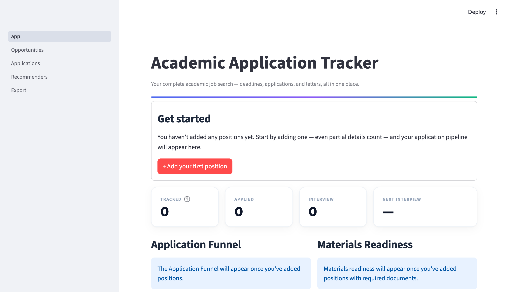
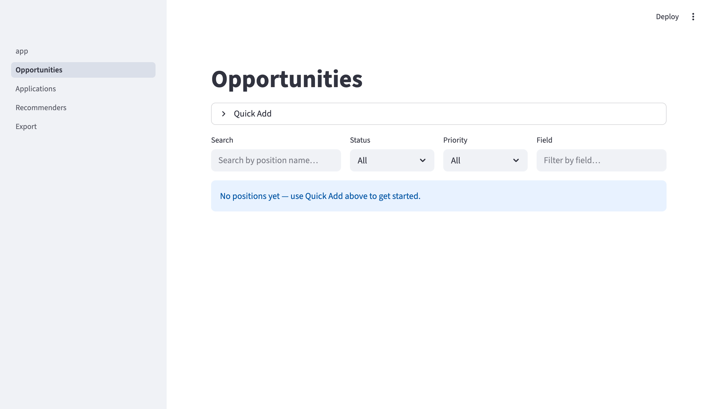
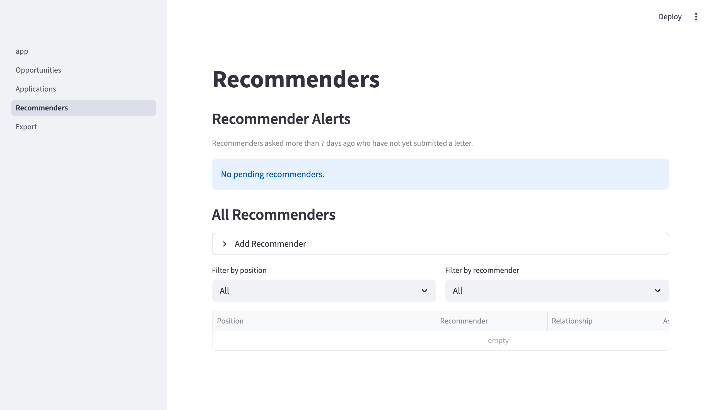

# Academic Application Tracker

A local Streamlit dashboard that answers one question every morning: **"What do I do today?"**

Track dozens of postdoc, PhD, faculty, and fellowship applications in parallel — deadlines, recommendation letters, materials checklists, interview rounds — without a single missed follow-up.



[](https://github.com/YuZh98/academic-application-tracker/actions/workflows/ci.yml) [](pyproject.toml) [](pyproject.toml) [](LICENSE)

---

## Why not a spreadsheet?

| Problem | Spreadsheet | This tool |
|---------|-------------|-----------|
| Deadline urgency | Manual sorting, easy to miss | Auto-computed, color-coded red/yellow by proximity, surfaced every session |
| Recommender tracking | One row per person, no per-position state | One recommender × seven positions = seven independent states; flags overdue, offers one-click mailto |
| Materials readiness | Scattered notes | Per-position checklist (CV, cover letter, research statement, …); dashboard shows ready-to-submit count at a glance |
| Daily action items | You figure it out | Dashboard tells you |

---

## Quick start

```bash
git clone https://github.com/YuZh98/academic-application-tracker.git
cd academic-application-tracker
python3 -m venv .venv
source .venv/bin/activate
pip install -r requirements.txt
streamlit run app.py
```

Python ≥ 3.11. Open the URL Streamlit prints (default `http://localhost:8501`).  
The SQLite database is created on first run — the empty-state screen walks you through adding your first position.

---

## Features

### Dashboard
KPI grid (Tracked / Applied / Interview / Next Interview), application funnel, materials readiness panel, upcoming deadlines, and recommender alerts — one screen, one daily answer.

### Opportunities
Quick-add a position in under 30 seconds. Full edit panel with four tabs (Overview / Requirements / Materials / Notes). Filter by status, priority, field, or full-text search. Urgency-banded deadline column.



### Applications
Per-position card: applied date, confirmation, response, result, outcome. Inline multi-round interview log. Pipeline cascades automatically: saved → applied → interview → offer.

### Recommenders
Pending-alert cards with mailto and LLM-prompt helpers to draft a follow-up. Full (position × recommender) matrix with inline edit. Flags anyone asked more than 7 days ago who hasn't confirmed.



### Export
Every database write auto-regenerates plaintext markdown files (`OPPORTUNITIES.md`, `PROGRESS.md`, `RECOMMENDERS.md`) in the `exports/` folder — always a fresh, portable backup of your entire job-search state. Manual regenerate + per-file download also available.

---

## Stack

| Layer | Technology |
|-------|-----------|
| UI | Streamlit 1.57 · Plotly |
| Data | SQLite · pandas |
| Language | Python 3.11+ |
| Dev tooling | pytest · ruff · pyright |

---

<details>
<summary><strong>Engineering deep-dive</strong></summary>

### Architecture — four strict layers

```
config.py     constants, vocabularies, import-time invariants
database.py   SQL only — never imports streamlit
exports.py    markdown writers — called by database, never by pages
pages/*.py    display only — no raw SQL, no direct exports import
```

Layer contracts are enforced by cohesion tests that fail CI if any rule drifts.

### Testing

**889 tests, 97% coverage.** Integration tests use the official `streamlit.testing.v1.AppTest` harness against real page files; unit tests run against per-test temp SQLite files via a `db` fixture. A second test pass with `-W error::DeprecationWarning` catches Streamlit-API drift before it surfaces on upgrades.

### CI pipeline (every PR)

- ruff lint (zero warnings)
- pyright strict-basic (zero errors)
- pytest (two passes: normal + deprecation-as-error)
- Status-literal grep — no hardcoded status strings in page code; all vocabulary routed through `config.py`

### Config-driven schema

Adding a new required document type (e.g. "Portfolio") = one tuple appended to `config.REQUIREMENT_DOCS`. `init_db()` adds the columns automatically on next start. No other file changes needed.

### Import-time invariants

`config.py` asserts structural integrity at module load — every status has a color and a label, urgency thresholds are ordered, funnel buckets cover all statuses exactly once. Misconfiguration aborts startup with a clear traceback before any page renders.

### Spec-first development

[`DESIGN.md`](DESIGN.md) is the authoritative spec for the schema, page contracts, cascade rules, and export format. Implementation tracks the spec; deviations land as spec amendments with commit references.

</details>

---

## Project structure

```
app.py                 Dashboard home page
config.py              Constants — statuses, thresholds, vocabularies
database.py            SQL reads/writes; calls exports.write_all() on every write
exports.py             Markdown generators (OPPORTUNITIES / PROGRESS / RECOMMENDERS)
pages/
  1_Opportunities.py   Position CRUD
  2_Applications.py    Application + interview tracking
  3_Recommenders.py    Recommender tracker + reminder helpers
  4_Export.py          Manual export trigger + per-file download buttons
tests/                 889-test suite (AppTest + unit + cohesion)
docs/
  adr/                 Architecture decision records
  dev-notes/           Streamlit gotchas, dev setup, git workflow notes
  ui/                  Wireframes + screenshots
DESIGN.md              Authoritative spec
GUIDELINES.md          Coding conventions
CHANGELOG.md           Per-release narrative log
```

---

## Documentation

| Doc | Start here if… |
|-----|---------------|
| [`DESIGN.md`](DESIGN.md) | You want to understand the schema, page contracts, cascade rules, or export format |
| [`GUIDELINES.md`](GUIDELINES.md) | You want to contribute or understand the coding conventions |
| [`CHANGELOG.md`](CHANGELOG.md) | You want the per-release development narrative |
| [`docs/dev-notes/`](docs/dev-notes/) | You hit a Streamlit-specific gotcha or need dev setup details |

---

## License

[MIT](LICENSE)
