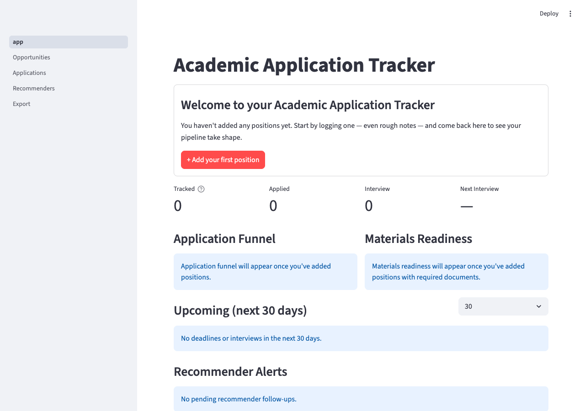

# Academic Application Tracker

[](https://github.com/YuZh98/academic-application-tracker/actions/workflows/ci.yml) [](pyproject.toml) [](pyproject.toml) [](LICENSE)

A local, single-user Streamlit app that answers one daily question
for an academic applicant: **"What do I do today?"** Tracks
positions, applications, interviews, and recommendation letters
across institutions with automated deadline alerts and markdown
exports as portable backups. Designed for the multi-stage
recommender-letter-driven application flows shared by **postdoc,
PhD, faculty, and fellowship** applications — anywhere you're
juggling deadlines, materials readiness, and follow-ups across many
institutions in parallel.



Built as a personal tool while job-hunting — and as a portfolio
piece demonstrating disciplined software engineering on a
non-trivial codebase.

---

## Features

- **Dashboard** — at-a-glance KPI grid (Tracked / Applied /
  Interview / Next Interview), application funnel chart, materials
  readiness panel, upcoming deadlines list, and recommender alert
  cards on the same screen.
- **Opportunities page** — quick-add form, full edit panel
  (Overview / Requirements / Materials / Notes tabs), filter bar
  with status / priority / field / search, urgency-banded deadline
  column.
- **Applications page** — per-position application detail card with
  applied date / confirmation / response / result, plus an inline
  interview list with per-row save and FK-cascading delete.
- **Recommenders page** — pending-letter alerts grouped by
  recommender (with "compose reminder email" mailto and per-tone LLM
  prompts to draft a follow-up), full all-recommenders table, inline
  edit, and delete.
- **Auto-export to markdown** — every database write also regenerates
  `exports/OPPORTUNITIES.md`, `PROGRESS.md`, and `RECOMMENDERS.md`,
  giving you a portable plain-text backup of your job-search state
  that survives any future framework change.
- **Pipeline cascades** — applying for the first time flips a
  position from `[SAVED]` → `[APPLIED]`; recording an Offer response
  flips it to `[OFFER]`; the first interview flips
  `[APPLIED]` → `[INTERVIEW]`. Cascade rules are codified in DESIGN
  §9.3 and unit-tested.

## Quick start

```bash
git clone https://github.com/YuZh98/academic-application-tracker.git
cd academic-application-tracker
python3 -m venv .venv
source .venv/bin/activate
pip install -r requirements.txt
streamlit run app.py
```

Open the URL Streamlit prints (default `http://localhost:8501`). The
SQLite database is created on first run; the empty-state hero will
walk you through adding your first position.

**Python:** ≥ 3.11 (declared in `pyproject.toml`).
**Stack:** Python · Streamlit 1.57 · SQLite · pandas · Plotly.
**Dev tooling:** pytest · ruff · pyright.

## Engineering practices

This codebase is built like a small production system, not a
personal script:

- **879 tests, 1 expected-fail.** Integration tests against the
  Streamlit pages use the official `streamlit.testing.v1.AppTest`
  harness; unit tests against the database + export layers run on a
  per-test temp SQLite file via the `db` fixture in
  [`tests/conftest.py`](tests/conftest.py).
- **Pyright type-check fence in CI.** Strict-basic mode, zero errors
  required for merge. Config in `[tool.pyright]`.
- **Ruff lint clean.** Pyflakes + pycodestyle E/W enforced.
- **Deprecation-strict pytest gate.** A second test pass with
  `-W error::DeprecationWarning` catches Streamlit-API drift before
  it bites users on a future upgrade.
- **CI runs all four gates on every PR**
  ([.github/workflows/ci.yml](.github/workflows/ci.yml)).
- **Architectural rules enforced.** `database.py` never imports
  `streamlit` (framework-agnostic); `pages/*.py` never import
  `exports.py` (one-way dependency); pages call `database.*`
  helpers, never raw SQL. Cohesion-pinning tests in
  [`tests/test_pages_cohesion.py`](tests/test_pages_cohesion.py)
  fail CI if these rules drift.
- **Atomic commits, descriptive messages.** Every PR is a
  small focused tier with `test(...)` → `feat(...)` → `chore(...)`
  rollup commit cadence (per `docs/internal/GUIDELINES.md` §11). Run
  `git log --oneline` for the audit trail.
- **Spec-first design.** [`DESIGN.md`](DESIGN.md) is the
  authoritative spec for the schema, page contracts, cascade rules,
  and exports format. Implementation tracks the spec; deviations get
  amendments + commit references.

## Project structure

```
app.py                 Dashboard home page
config.py              Constants — statuses, thresholds, vocabularies
database.py            SQL reads/writes; calls exports.write_all() on every write
exports.py             Markdown generators (OPPORTUNITIES / PROGRESS / RECOMMENDERS)
pages/
  1_Opportunities.py   Position CRUD
  2_Applications.py    Application + interview tracking
  3_Recommenders.py    Recommender tracker + reminder helpers
  4_Export.py          Manual export trigger + per-file download buttons
tests/                 879-test suite (AppTest + unit + cohesion)
docs/
  internal/            Agent-handoff + sprint-tracker docs (dev process)
  dev-notes/           Streamlit gotchas, dev setup, git workflow notes
  ui/                  Wireframes
  adr/                 Architecture decision records
DESIGN.md              Authoritative spec
GUIDELINES.md          Coding conventions
CHANGELOG.md           Per-release narrative log
LICENSE                MIT
```

## Documentation

- [`DESIGN.md`](DESIGN.md) — schema, page contracts, cascade rules,
  exports format. Read first for "how does this work?"
- [`GUIDELINES.md`](GUIDELINES.md) — coding conventions, TDD
  cadence, doc tiering, content routing. Read first for "how is
  this codebase organized?"
- [`CHANGELOG.md`](CHANGELOG.md) — per-release development log.
- [`docs/dev-notes/`](docs/dev-notes/) — Streamlit-specific gotchas,
  dev environment setup, deeper git-workflow notes.
- [`docs/internal/`](docs/internal/) — agent-handoff + sprint
  tracker; the project was built collaboratively with an agent
  pipeline ([orchestrator + implementer pattern](docs/internal/ORCHESTRATOR_HANDOFF.md))
  using Claude Code.

## Status

Currently at `v0.8.0` (Phase 7 closed). Roadmap toward `v1.0.0`:
schema cleanup (drop one deprecated column),
[responsive layout audit](docs/internal/TASKS.md),
Streamlit Cloud demo deploy. The daily-usage flows are stable; the
schema may evolve before `v1.0`.

## License

[MIT](LICENSE).

## Acknowledgments

Built with [Claude Code](https://claude.com/claude-code) using an
orchestrator + implementer agent pipeline. Architectural decisions,
review judgment, and merge calls remain the author's; the agent
pipeline ships the code.
